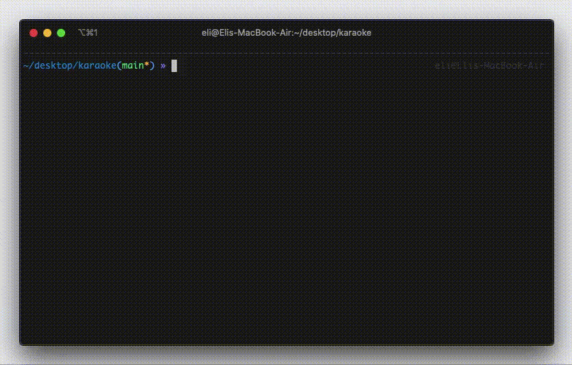

# karaoke
search, generate instrumentals (without vocals), playback, and look at lyrics in live time for any song!

# instructions
* clone the repo
* set python version to <3.8 (use [pyenv](https://github.com/pyenv/pyenv) if necessary)
* run `pip install -r requirements.txt` to install all required packages
* run `python karaoke.py`
* enter song name
* wait for song to finish processing and sing along when it starts to play!

# extra info
* downloaded songs are stored in /downloads folder
